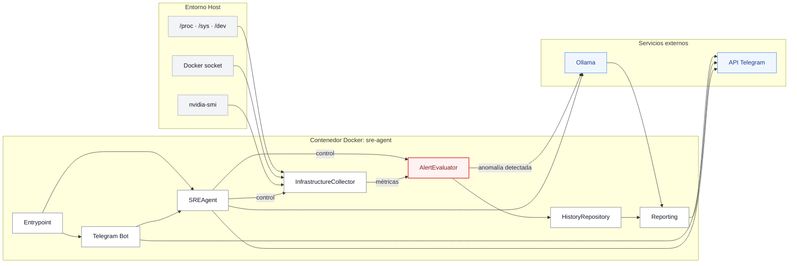
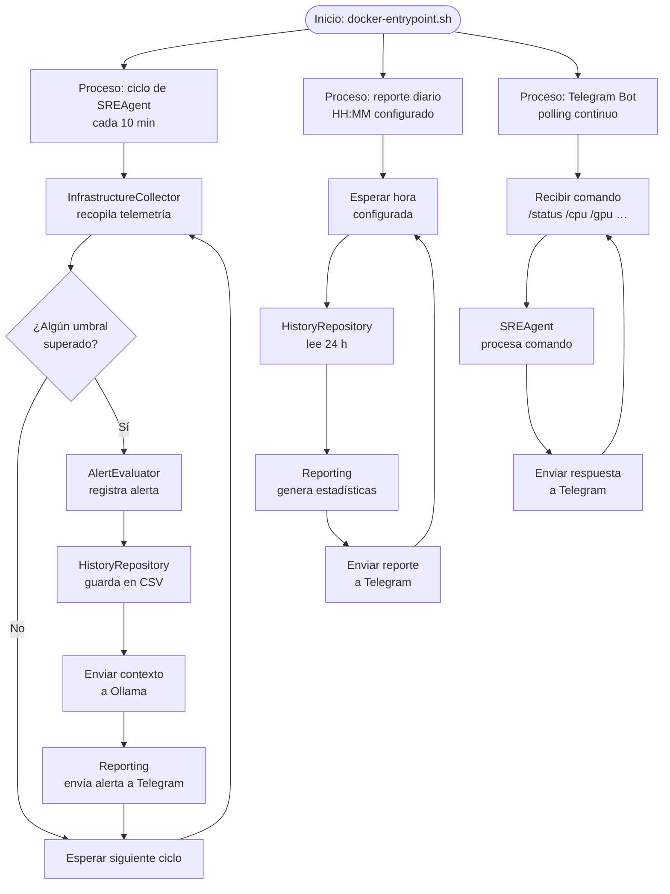

# Ollama SRE Agent

Agente autónomo de observabilidad y fiabilidad (SRE) para servidores Linux. Recoge telemetría de hardware, estado de almacenamiento (SMART), contenedores Docker y actualizaciones pendientes. Integra un modelo de lenguaje local mediante **Ollama** (`qwen2.5-coder:latest`) para diagnosticar anomalías en tiempo real y enviar un reporte diario vía **Telegram**.

---

## Características

| Capacidad | Descripción |
|---|---|
| Monitorización continua | Ciclo de 10 minutos: CPU, RAM, GPU NVIDIA, discos, Docker y SMART |
| Diagnóstico inteligente | Inferencia local con Ollama activada únicamente ante umbrales superados |
| Reporte matutino | Resumen diario con estadísticas de 24 h (mín/máx/media) enviado a Telegram |
| Bot de Telegram | Consultas bajo demanda mediante comandos de chat |
| Persistencia local | Historial de métricas en CSV dentro de un volumen Docker |

---

## Arquitectura



---

## Flujo de ejecución



---

## Comandos del bot

| Comando | Descripción |
|---|---|
| `/status` | Estado general del servidor |
| `/report` | Reporte diario bajo demanda |
| `/cpu` | Carga de CPU, temperatura y RAM |
| `/gpu` | Temperatura, VRAM y uso de GPU |
| `/disks` | Uso de discos |
| `/docker` | Estado de contenedores |
| `/info` | Características del sistema y hardware |
| `/sre <pregunta>` | Diagnóstico SRE con contexto enriquecido |
| `/help` | Lista de comandos disponibles |

---

## Inicio rápido

Consulta la guía completa en [`docs/installation.md`](docs/installation.md).

```bash
# 1. Clonar y entrar al repositorio
git clone https://github.com/k3ssdev/sre-agent.git
cd sre-agent

# 2. Crear el secret de Telegram
mkdir -p secrets
printf '%s' 'TOKEN_DE_TELEGRAM' > secrets/telegram_token
chmod 600 secrets/telegram_token

# 3. Configurar variables de entorno
cp .env.example .env
# Editar .env con TELEGRAM_CHAT_ID y, si es necesario, OLLAMA_URL

# 4. Arrancar
docker compose up -d --build
docker compose logs -f sre-agent
```

---

## Estructura del repositorio

```text
.
├── docs/
│   ├── installation.md           # Guía de instalación y puesta en marcha
│   └── testing.md                # Guía de pruebas automatizadas y manuales
├── src/
│   └── sre_agent/
│       ├── __main__.py           # Entrada: python -m sre_agent
│       ├── cli.py                # Interfaz de línea de comandos
│       ├── agent.py              # Orquestación y casos de uso
│       ├── config.py             # Carga de configuración y .env
│       ├── collectors.py         # Recolección de telemetría del host
│       ├── history.py            # Persistencia de muestras en CSV
│       ├── alerts.py             # Evaluación de umbrales
│       ├── integrations.py       # Clientes Ollama y Telegram
│       └── reporting.py          # Formateo de reportes
├── scripts/
│   ├── docker-entrypoint.sh      # Ciclos del agente y reporte diario
│   └── manual-test.py            # Ejecución manual de funciones
├── tests/
│   └── test_agent_commands.py    # Suite de pruebas unitarias
├── pyproject.toml                # Metadatos y dependencias del paquete
├── Dockerfile
├── compose.yaml                  # Definición de servicios Docker
├── .env.example                  # Plantilla de variables de entorno
└── .gitignore
```

---

## Requisitos del sistema

- Docker Engine ≥ 24 con Docker Compose
- Ollama en ejecución en el host (puerto 11434)
- Bot de Telegram y su token (`@BotFather`) y chat ID
- Drivers NVIDIA instalados en el host (opcional, para métricas de GPU)

---

## Documentación adicional

- [Instalación y puesta en marcha](docs/installation.md)
- [Pruebas](docs/testing.md)
